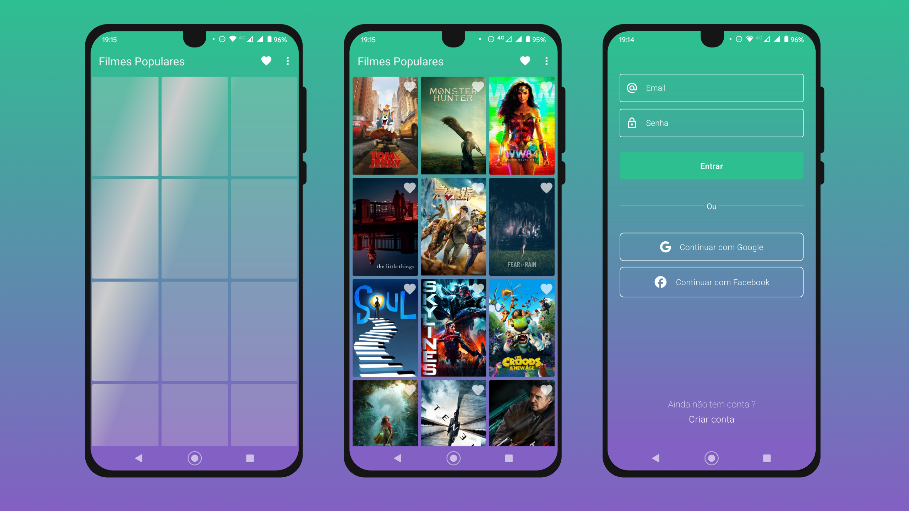

<h1 align="center">
    Movies Saver (sério não consegui pensar em um nome melhor)
</h1>

  <a href="#rocket-tecnologias">Tecnologias</a>&nbsp;&nbsp;&nbsp;|&nbsp;&nbsp;&nbsp;
  <a href="#-projeto">Projeto</a>&nbsp;&nbsp;&nbsp;|&nbsp;&nbsp;&nbsp;
  <a href="#memo-licença">Licença</a>

 

  

## :rocket: Tecnologias

Esse projeto foi desenvolvido com as seguintes tecnologias:

- [Android](https://developer.android.com/studio)
- [Kotlin](https://developer.android.com/kotlin)
- [Facebook Shimmer](https://github.com/facebook/shimmer-android)
- [Jetpack Navigation](https://developer.android.com/jetpack/androidx/releases/navigation)
- [Material Design Components](https://material.io/components)
- [Retrofit](https://square.github.io/retrofit/g)
- [Data Binding](https://developer.android.com/topic/libraries/data-binding)
- [Archtecture Components](https://developer.android.com/topic/libraries/architecture)

## 💻 Projeto

Movies saver é uma app de filmes em que você pode ver o que há de popular e salvar nos seus favoritos, e acessar de onde quiser(pelo app claro).

## :memo: Licença

Esse projeto está sob a licença MIT. Veja o arquivo [LICENSE](LICENSE.md) para mais detalhes.

---

Feito com ♥ by Vinicius :wave:
